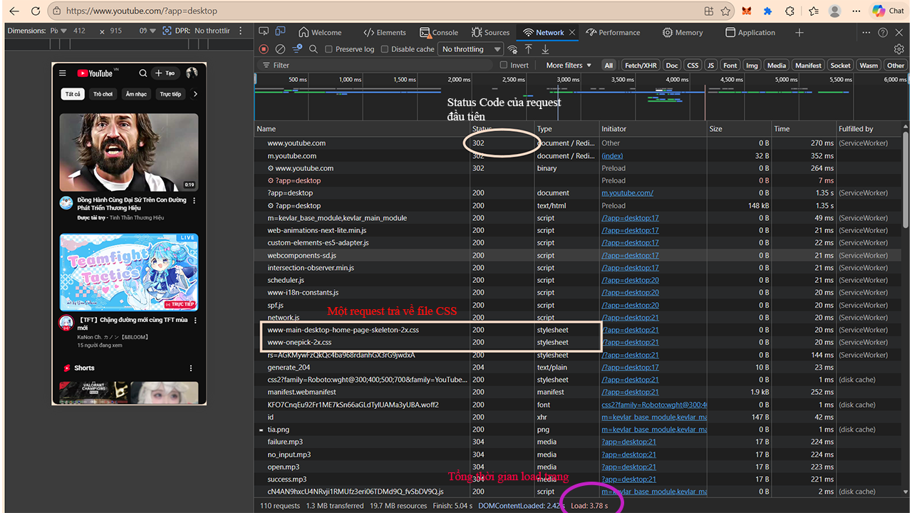

Đặng Thanh Hưởng - 66KTPM1

Phần A — KIỂM TRA ĐỌC HIỂU

Câu A1:
1. Các bước xảy ra khi gõ https://shopee.vn vào trình duyệt và nhấn Enter(Nguồn tham chiếu: File 01_introduction_html_universe.md, Phần "Cuộc Hành Trình 0.3 Giây Xuyên Đại Dương"):

-Request xuất phát từ laptop hoặc thiết bị đang dùng và đi qua router WiFi.

-Tín hiệu tiếp tục truyền qua nhà mạng VNPT và chạy xuyên qua hệ thống cáp quang.

-Request được gửi đến data center của Shopee.

-Server của Shopee tiếp nhận và xử lý yêu cầu.

-Server trả về kết quả, dữ liệu chạy ngược lại: đường cáp quang → VNPT → router và về lại thiết bị đang dùng.

-Trình duyệt nhận các file HTML, CSS, JS từ server: → render để hiển thị ra giao diện hoàn chỉnh

2. Thông tin trong tab Network của Chrome DevTools - (Nguồn tham chiếu: File 01_introduction_html_universe.md, Phần "4.3. Developer Tools (F12) — 'Kính hiển vi' cho website")

-Tab Network cho thấy các thông tin về requests và responses.

Câu A2:

- Trang web trên bị Google đánh giá SEO thấp vì đoạn code đang lạm dụng thẻ "div" thay vì sử dụng các thẻ semantic phù hợp mục đích (04_visible_part_html.md, Phần "Semantic HTML5 — Bản đồ Semantic Elements")

- Việc sử dụng đúng thẻ semantic tương ứng với từng mục đích sẽ giúp Google hiểu rõ được nội dung cấu trúc của trang web, từ đó giúp tối ưu hóa SEO tốt hơn (04_visible_part_html.md, Phần "Trang Web Trống Rỗng Vs Trang Web Sống Động'")

Lỗi 1: Sử dụng (div class="header") cho phần đầu trang chứa logo và menu chính thay vì sử dụng thẻ "header" - (04_visible_part_html.md, Phần "Semantic HTML5 — Bản đồ Semantic Elements")

-Lỗi 2: Sử dụng (div class="menu") cho phần chứa các liên kết điều hướng thay vì sử dụng thẻ "nav" - (04_visible_part_html.md, Phần "Semantic HTML5 — Bản đồ Semantic Elements")

-Lỗi 3: Sử dụng (div class="main") để bọc toàn bộ vùng nội dung chính thay vì sử dụng thẻ "main" - (04_visible_part_html.md, Phần "Semantic HTML5 — Bản đồ Semantic Elements")

-Lỗi 4: Sử dụng (div class="product") cho một khối thông tin sản phẩm độc lập thay vì sử dụng thẻ "article" -  (04_visible_part_html.md, Phần "Bản đồ Semantic Elements")

-Lỗi 5: Sử dụng (div class="footer") cho phần thông tin bản quyền (copyright) ở cuối trang thay vì sử dụng thẻ "footer" -(04_visible_part_html.md, Phần "Semantic HTML5 — Bản đồ Semantic Elements")

-Sửa lại code: 
<header>
    
ShopTLU

    <nav>
        
<a href="/">Trang chủ</a>

        
<a href="/products">Sản phẩm</a>

    </nav>
</header>
<main>
    <article>
        
iPhone 16 Pro

        
25.990.000đ

        

    </article>
</main>
<footer>© 2026 ShopTLU</footer>
 
 Câu A3: 
 hình vẽ 
 
 

 Giải thích: Kết quả hiển thị trên được quyết định bởi đặc tính của hai loại thẻ HTML cơ bản là Block và Inline:

- Thẻ "div" là phần tử Block: Thẻ Block luôn chiếm cả dòng của trình duyệt
    +Do đó, mỗi khi khai báo "div" (Hộp 1, Hộp 2, Hộp 3), nội dung bên trong sẽ tự động bắt đầu ở một dòng mới và đẩy các phần tử phía sau xuống dòng tiếp theo
- Thẻ "span" và "strong" là phần tử Inline: Thẻ Inline chỉ chiếm nội dung
    +Vì vậy, Text A và Text B sẽ hiển thị nằm cạnh nhau trên cùng một dòng. Tương tự, Text C và Text D cũng sẽ tự động xếp liền kề nhau trên một dòng riêng biệt nằm giữa Hộp 2 và Hộp 3

Câu A4:
- Sự khác biệt giữa ba thẻ "thead", "tbody", "tfoot" nằm ở vai trò phân chia các khu vực cấu trúc của 1 bảng dữ liệu ( 05_tables_hyperlinks.md, Phần "Cấu trúc cơ bản"):
1. Thẻ "thead" đống vai trò là phần Header chuyên dùng để chứa các ô tiêu đề cột.
2. Thẻ "tbody" đóng vai trò là phần Body, là nơi chứa các hàng dữ liệu chính của bảng
3. Thẻ "tfoot" đóng vai trò phần Footer, được dùng để chứa thông tin tổng kết của bảng
- Không nên dùng table để tạo layout cho web vì:
    + Quy tắc của HTML bắt buộc thẻ "table" chỉ được dùng cho các nội dung dữ liệu dạng bảng
    + Việc dùng bảng để thiết kế layout trang web chỉ là cách làm cữ của ngày xưa và hiện tại việc này được đánh giá là sai
    + Hiện nay đã có nhứng công cụ chuyên dụng và hiện đại hơn để dàn trang là CSS Grid và Flexbox.

Phần B:

Câu B4: 

1. Phân tích tab Elements 

- a. 3 thẻ semantic HTML5 được trang sử dụng:

    + `<header class="header v2024...">`: Nằm ở phần đầu của `<body>`, được sử dụng để chứa logo, thanh tìm kiếm và các thành phần điều hướng trên = cùng của trang.
    + `<footer class="footer v2024">`: Nằm ở phần cuối của `<body>`, dùng để chứa các thông tin bản quyền, địa chỉ liên hệ, và các liên kết chính sách của website.
    + `<h1>`: Thẻ tiêu đề chính (ở đây trang dùng class `sc-only` để ẩn đi về mặt hiển thị nhưng vẫn giữ cho mục đích SEO hoặc screen reader).

- b. 2 thẻ không dùng đúng semantic 
    + `
`: Khối thẻ này chứa các liên kết điều hướng đầu trang. Thay vì dùng `
` mang tính chung chung, trang nên sử dụng thẻ `<nav>` để chuẩn semantic hơn cho một thanh điều hướng.
    + `
`: Khối này đang đóng vai trò bao bọc toàn bộ nội dung chính của trang chủ. Sẽ chuẩn xác hơn về mặt ngữ nghĩa nếu sử dụng thẻ `<main>`.

2. Phân tích thẻ `<table>`

- `<table>` được sử dụng để hiển thị chi tiết "Thông số kỹ thuật/Cấu hình" của sản phẩm
- Trang có sử dụng thẻ `<tbody>` để nhóm các hàng chứa dữ liệu `<tr>` lại với nhau.
- Trang không sử dụng thẻ `<thead>`.

3. Phân tích thẻ `<form>`

 

- Thẻ `<form>` này không có thuộc tính `action` và `method`.                
- Form này chỉ sử dụng duy nhất một loại là: `<input type="hidden">`.
