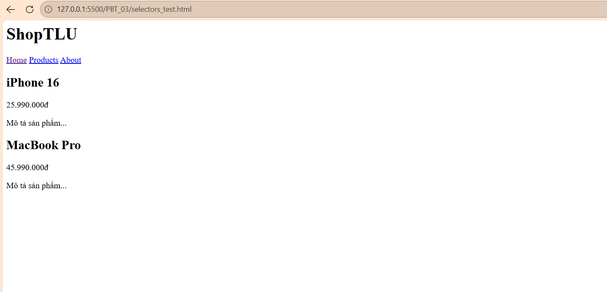

1. Inline CSS
Cách này nhúng trực tiếp các quy tắc CSS vào trong thuộc tính style của từng thẻ HTML cụ thể.  

- Ví dụ:`<h1 style="color: #2563eb; font-size: 32px;">Tiêu đề màu xanh</h1>`
- Ưu điểm: Có tính ưu tiên cao nhất, hữu ích khi cần ghi đè tạm thời hoặc sửa lỗi khẩn cấp.  

- Nhược điểm: Không thể tái sử dụng code, làm file HTML trở nên cồng kềnh, khó bảo trì và không được trình duyệt lưu vào bộ nhớ đệm.  

- Khi nào nên dùng: Chỉ dùng cho các trường hợp khẩn cấp, chỉnh sửa nhanh một element duy nhất hoặc khi viết email HTML.  

2. Internal CSS
CSS được viết tập trung trong thẻ `<style>`, thường đặt trong phần `<head>` của tệp HTML.
- Ví dụ:
```html
<head>
        <style>
            h1 { color: #2563eb; font-size: 32px; }
        </style>
    </head>
```
- Ưu điểm: Quản lý tập trung các style của một trang web duy nhất tại một chỗ, không cần tạo file riêng
- Nhược điểm: Chỉ có tác dụng cho trang hiện tại, không thể chia sẻ style cho các trang khác trong cùng website
- Khi nào nên dùng: Phù hợp cho các bản mẫu  hoặc các trang web đơn
3. External CSS
Đây là cách chuẩn nhất trong thực tế. Toàn bộ CSS được viết trong một file riêng (đuôi `.css`) và liên kết vào HTML qua thẻ `<link>`

- Ví dụ:  Trong file HTML:`<link rel="stylesheet" href="styles.css">`
        Trong file styles.css:* `h1 { color: #2563eb; font-size: 32px; }`
- Ưu điểm:Tái sử dụng được cho nhiều trang, dễ bảo trì, giúp trang tải nhanh hơn nhờ cơ chế lưu bộ nhớ đệm của trình duyệt
- Nhược điểm: Phải tốn thêm một yêu cầu HTTP để tải file CSS về trong lần đầu tiên truy cập.
- Khi nào nên dùng: Dùng cho mọi dự án thực tế và chuyên nghiệp


Câu 2: 
1. h1   → Chọn: ShopTLU

2. .price   → Chọn: 25.990.000đ và 45.990.000đ

3. #app header   → Chọn: Toàn bộ nội dung bên trong thẻ `<header>` (bao gồm: ShopTLU, Home, Products, About)

4. nav a:first-child   → Chọn: Home

5. .product.featured h2    → Chọn: MacBook Pro

6. article > p     → Chọn: 25.990.000đ, Mô tả sản phẩm... (của iPhone 16) và 45.990.000đ, Mô tả sản phẩm... (của MacBook Pro)

7. a[href="/"]     → Chọn: Home

8. .top-bar.dark h1    → Chọn: ShopTLU

